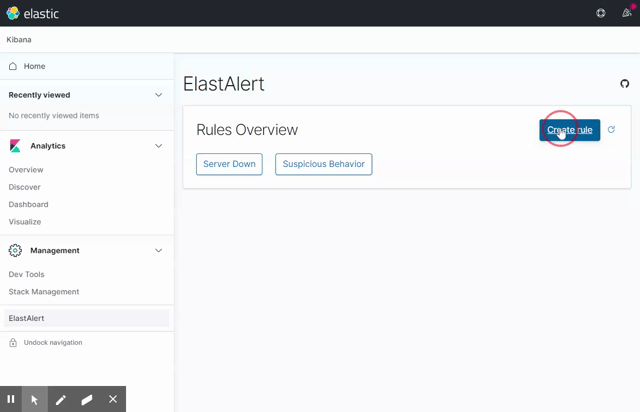

# Fork of [bitsensor/elastalert-kibana-plugin](https://github.com/bitsensor/elastalert-kibana-plugin)

Official repository is not maintained anymore.

Aim of this fork is to support new versions of Kibana (after migration to Kibana New Platform starts from 7.10).

There is still some work to be done, but this version should work ;)

For older versions check: [nsano-rururu/elastalert-kibana-plugin](https://github.com/nsano-rururu/elastalert-kibana-plugin)

# ElastAlert Kibana Plugin

> This plugin provides a way to create, test and edit ElastAlert rules within Kibana.


---

## Demo


## Requirements
- [ElastAlert2 Server](https://github.com/Karql/elastalert2-server) - A server that runs ElastAlert2 and exposes REST API's for manipulating rules and alerts.
- Kibana 7.10.0 or higher

## Installation
Check the [releases](https://github.com/karql/elastalert-kibana-plugin/releases) page to download and install the latest version of this plugin that is compatible with your Kibana version. Please be aware that you will need a running ElastAlert server to make use of this plugin.

[ElastAlert2 Server Docker Images](https://hub.docker.com/r/karql/elastalert2-server)

⚠️ If there is no released version for Kibana you use you can try to build plugin be your own. In [contribution guide](CONTRIBUTING.md) there is detailed instruction how to do it.

## Configuration
By default the plugin will connect to `http://localhost:3030`. If your ElastAlert server is running on a different host or port add/change the following options in your `config/kibana.yml` file: 

```
elastalertKibanaPlugin.serverSsl: false
elastalertKibanaPlugin.serverHost: localhost
elastalertKibanaPlugin.serverPort: 3030
```

⚠️ from version 1.4.0 config section name has been changed:
`elastalert-kibana-plugin -> elastalertKibanaPlugin`

## Contribution
Please report any issues or suggestions you have on the [issues page](https://github.com/karql/elastalert-kibana-plugin/issues). If you want to create a pull request please check our [contribution guide](CONTRIBUTING.md).